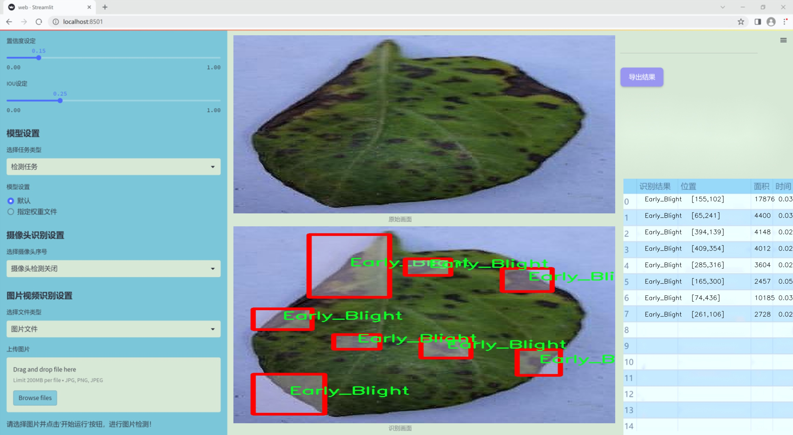
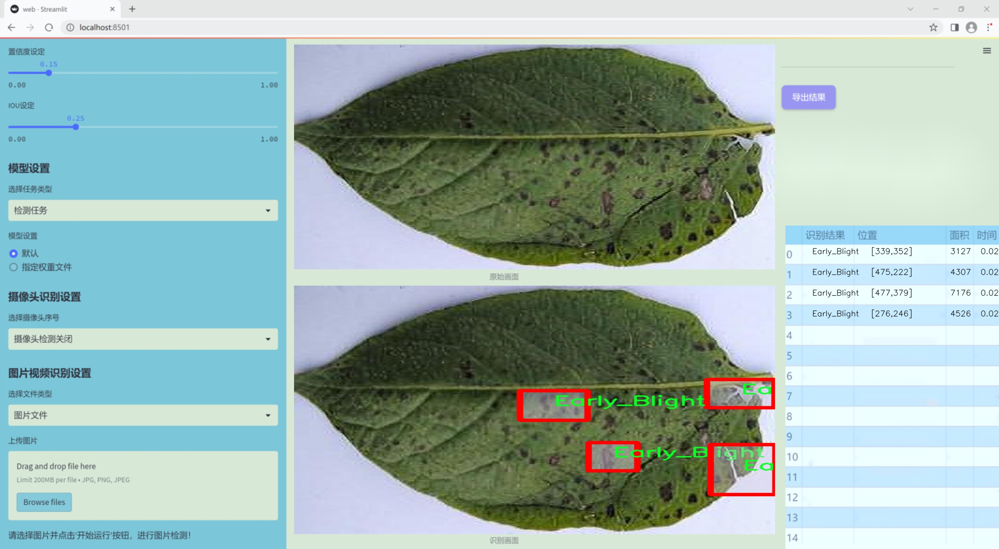
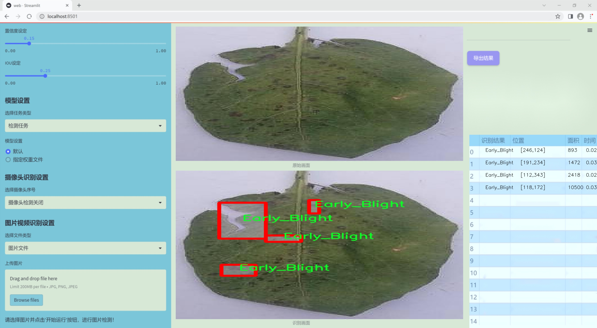
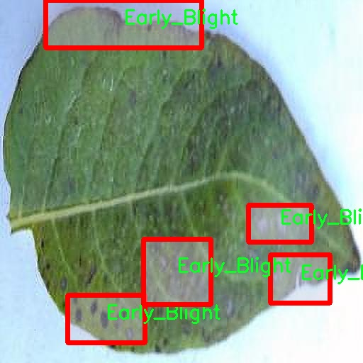
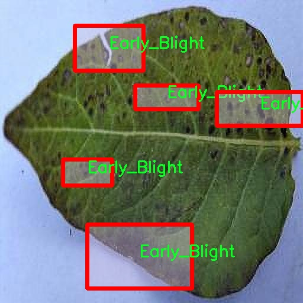
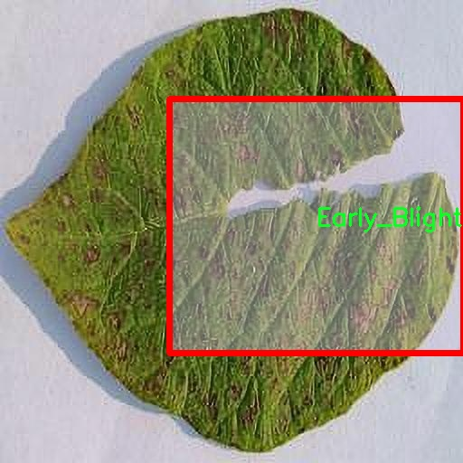
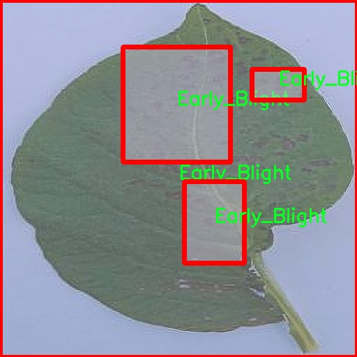
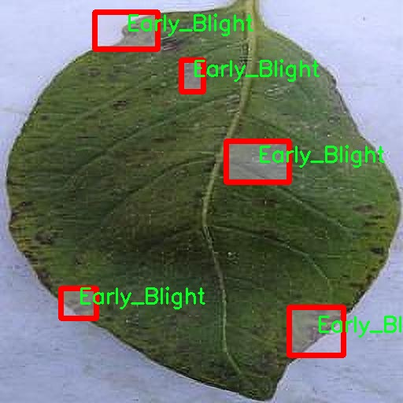

### 1.背景意义

研究背景与意义

随着全球农业生产的不断发展，植物病害的监测与管理已成为保障粮食安全和提高农业产量的重要环节。植物病害不仅影响作物的生长和产量，还可能对生态环境造成严重影响。因此，及时、准确地识别和分类植物病害，对于制定有效的防治措施至关重要。传统的植物病害检测方法多依赖于人工观察和经验判断，效率低下且容易受到主观因素的影响。近年来，计算机视觉技术的快速发展为植物病害检测提供了新的解决方案，尤其是基于深度学习的目标检测算法在图像识别领域表现出色。

本研究旨在基于改进的YOLOv11模型，构建一个高效的植物病害检测系统。我们将利用一个包含4100张图像的数据集，该数据集涵盖了三种植物病害类别：早期枯萎、健康状态和晚期枯萎。这些类别的细致划分为模型的训练和评估提供了良好的基础。通过对这些图像的深度学习训练，系统能够自动识别和分类不同类型的植物病害，从而为农民和农业管理者提供及时的决策支持。

此外，随着数据集的不断丰富和模型的持续优化，基于YOLOv11的植物病害检测系统将具备更强的适应性和准确性。该系统不仅能够提高病害检测的效率，还能减少人工成本，推动农业智能化的发展。通过将先进的计算机视觉技术应用于植物病害检测，我们希望能够为农业生产提供更为科学和高效的解决方案，促进可持续农业的发展。

### 2.视频效果

[2.1 视频效果](https://www.bilibili.com/video/BV1TSBTYTE76/)

### 3.图片效果







##### [项目涉及的源码数据来源链接](https://kdocs.cn/l/cszuIiCKVNis)**

注意：本项目提供训练的数据集和训练教程,由于版本持续更新,暂不提供权重文件（best.pt）,请按照6.训练教程进行训练后实现上图演示的效果。

### 4.数据集信息

##### 4.1 本项目数据集类别数＆类别名

nc: 3
names: ['Early_Blight', 'Healthy', 'Late_Blight']


该项目为【图像分割】数据集，请在【训练教程和Web端加载模型教程（第三步）】这一步的时候按照【图像分割】部分的教程来训练

##### 4.2 本项目数据集信息介绍

本项目数据集信息介绍

本项目旨在改进YOLOv11的植物病害检测系统，所使用的数据集专注于植物病害的识别与分类，特别是针对“早期枯萎病”和“晚期枯萎病”这两种病害的研究。数据集包含三类主要类别，分别为“Early_Blight”（早期枯萎病）、“Healthy”（健康植物）和“Late_Blight”（晚期枯萎病），总类别数量为三。数据集的构建过程涵盖了大量的植物图像，这些图像来源于不同的生长环境和气候条件，以确保模型的泛化能力和鲁棒性。

在数据采集阶段，我们注重选择不同生长阶段的植物样本，特别是早期和晚期枯萎病的表现，以便于模型能够有效识别出病害的早期症状和后期发展状态。每个类别的图像均经过精心标注，确保数据的准确性和一致性。这些图像不仅包括健康植物的特征，还涵盖了不同程度的病害表现，帮助模型学习到病害的多样性和复杂性。

此外，为了提高模型的训练效果，我们还进行了数据增强处理，包括旋转、缩放、翻转等操作，增加了数据集的多样性，从而提高模型在实际应用中的表现。通过使用这个精心构建的数据集，我们期望能够显著提升YOLOv11在植物病害检测中的准确性和效率，为农业生产提供更为可靠的技术支持。最终目标是实现一个高效、准确的植物病害检测系统，帮助农民及时识别和处理植物病害，从而提高作物产量和质量。











### 5.全套项目环境部署视频教程（零基础手把手教学）

[5.1 所需软件PyCharm和Anaconda安装教程（第一步）](https://www.bilibili.com/video/BV1BoC1YCEKi/?spm_id_from=333.999.0.0&vd_source=bc9aec86d164b67a7004b996143742dc)


[5.2 安装Python虚拟环境创建和依赖库安装视频教程（第二步）](https://www.bilibili.com/video/BV1ZoC1YCEBw?spm_id_from=333.788.videopod.sections&vd_source=bc9aec86d164b67a7004b996143742dc)

### 6.改进YOLOv11训练教程和Web_UI前端加载模型教程（零基础手把手教学）

[6.1 改进YOLOv11训练教程和Web_UI前端加载模型教程（第三步）](https://www.bilibili.com/video/BV1BoC1YCEhR?spm_id_from=333.788.videopod.sections&vd_source=bc9aec86d164b67a7004b996143742dc)


按照上面的训练视频教程链接加载项目提供的数据集，运行train.py即可开始训练



     Epoch   gpu_mem       box       obj       cls    labels  img_size
     1/200     20.8G   0.01576   0.01955  0.007536        22      1280: 100%|██████████| 849/849 [14:42<00:00,  1.04s/it]
               Class     Images     Labels          P          R     mAP@.5 mAP@.5:.95: 100%|██████████| 213/213 [01:14<00:00,  2.87it/s]
                 all       3395      17314      0.994      0.957      0.0957      0.0843

     Epoch   gpu_mem       box       obj       cls    labels  img_size
     2/200     20.8G   0.01578   0.01923  0.007006        22      1280: 100%|██████████| 849/849 [14:44<00:00,  1.04s/it]
               Class     Images     Labels          P          R     mAP@.5 mAP@.5:.95: 100%|██████████| 213/213 [01:12<00:00,  2.95it/s]
                 all       3395      17314      0.996      0.956      0.0957      0.0845

     Epoch   gpu_mem       box       obj       cls    labels  img_size
     3/200     20.8G   0.01561    0.0191  0.006895        27      1280: 100%|██████████| 849/849 [10:56<00:00,  1.29it/s]
               Class     Images     Labels          P          R     mAP@.5 mAP@.5:.95: 100%|███████   | 187/213 [00:52<00:00,  4.04it/s]
                 all       3395      17314      0.996      0.957      0.0957      0.0845


###### [项目数据集下载链接](https://kdocs.cn/l/cszuIiCKVNis)

### 7.原始YOLOv11算法讲解


###### YOLOv11改进方向

与YOLOv 10相比，YOLOv 11有了巨大的改进，包括但不限于：

  * 增强的模型结构：模型具有改进的模型结构，以获取图像处理并形成预测
  * GPU优化：这是现代ML模型的反映，GPU训练ML模型在速度和准确性上都更好。
  * 速度：YOLOv 11模型现在经过增强和GPU优化以用于训练。通过优化，这些模型比它们的前版本快得多。在速度上达到了25%的延迟减少！
  * 更少的参数：更少的参数允许更快的模型，但v11的准确性不受影响
  * 更具适应性：更多支持的任务YOLOv 11支持多种类型的任务、多种类型的对象和多种类型的图像。

###### YOLOv11功能介绍

Glenn Jocher和他的团队制作了一个令人敬畏的YOLOv 11迭代，并且在图像人工智能的各个方面都提供了YOLO。YOLOv 11有多种型号，包括：

  * 对象检测-在训练时检测图像中的对象
  * 图像分割-超越对象检测，分割出图像中的对象
  * 姿态检测-当用点和线训练时绘制一个人的姿势
  * 定向检测（OBB）：类似于对象检测，但包围盒可以旋转
  * 图像分类-在训练时对图像进行分类

使用Ultralytics Library，这些模型还可以进行优化，以：

  * 跟踪-可以跟踪对象的路径
  * 易于导出-库可以以不同的格式和目的导出
  * 多场景-您可以针对不同的对象和图像训练模型

此外，Ultralytics还推出了YOLOv 11的企业模型，该模型将于10月31日发布。这将与开源的YOLOv
11模型并行，但将拥有更大的专有Ultralytics数据集。YOLOv 11是“建立在过去的成功”的其他版本的之上。

###### YOLOv11模型介绍

YOLOv 11附带了边界框模型（无后缀），实例分割（-seg），姿态估计（-pose），定向边界框（-obb）和分类（-cls）。

这些也有不同的尺寸：纳米（n），小（s），中（m），大（l），超大（x）。


YOLOv11模型

###### YOLOv11与前版本对比

与YOLOv10和YOLOv8相比，YOLOv11在Ultralytics的任何帖子中都没有直接提到。所以我会收集所有的数据来比较它们。感谢Ultralytics：

**检测：**


YOLOv11检测统计


YOLOv10检测统计

其中，Nano的mAPval在v11上为39.5，v10上为38.5；Small为47.0 vs 46.3，Medium为51.5 vs
51.1，Large为53.4 vs 53.2，Extra Large为54.7vs
54.4。现在，这可能看起来像是一种增量增加，但小小数的增加可能会对ML模型产生很大影响。总体而言，YOLOv11以0.3
mAPval的优势追平或击败YOLOv10。

现在，我们必须看看速度。在延迟方面，Nano在v11上为1.55 , v10上为1.84，Small为2.46 v2.49，Medium为4.70
v4.74，Large为6.16 v7.28，Extra Large为11.31
v10.70。延迟越低越好。YOLOv11提供了一个非常低的延迟相比，除了特大做得相当差的前身。

总的来说，Nano模型是令人振奋的，速度更快，性能相当。Extra Large在性能上有很好的提升，但它的延迟非常糟糕。

**分割：**


YOLOV11 分割统计


YOLOV9 分割统计


YOLOV8 分割数据

总体而言，YOLOv 11上的分割模型在大型和超大型模型方面比上一代YOLOv 8和YOLOv 9做得更好。

YOLOv 9 Segmentation没有提供任何关于延迟的统计数据。比较YOLOv 11延迟和YOLOv 8延迟，发现YOLOv 11比YOLOv
8快得多。YOLOv 11将大量GPU集成到他们的模型中，因此期望他们的模型甚至比CPU测试的基准更快！

姿态估计：


YOLOV11姿态估计统计


YOLOV8姿态估计统计

YOLOv 11的mAP 50 -95统计量也逐渐优于先前的YOLOv 8（除大型外）。然而，在速度方面，YOLOv
11姿势可以最大限度地减少延迟。其中一些延迟指标是版本的1/4！通过对这些模型进行GPU训练优化，我可以看到指标比显示的要好得多。

**定向边界框：**


YOLOv11 OBB统计


YOLOv8 OBB统计

OBB统计数据在mAP
50上并不是很好，只有非常小的改进，在某种程度上小于检测中的微小改进。然而，从v8到v11的速度减半，这表明YOLOv11在速度上做了很多努力。

**最后，分类：**


YOLOv 11 CLS统计


YOLOv8 CLS统计

从v8到v11，准确性也有了微小的提高。然而，速度大幅上升，CPU速度更快的型号。


### 8.200+种全套改进YOLOV11创新点原理讲解

#### 8.1 200+种全套改进YOLOV11创新点原理讲解大全

由于篇幅限制，每个创新点的具体原理讲解就不全部展开，具体见下列网址中的改进模块对应项目的技术原理博客网址【Blog】（创新点均为模块化搭建，原理适配YOLOv5~YOLOv11等各种版本）

[改进模块技术原理博客【Blog】网址链接](https://gitee.com/qunmasj/good)


#### 8.2 精选部分改进YOLOV11创新点原理讲解

###### 这里节选部分改进创新点展开原理讲解(完整的改进原理见上图和[改进模块技术原理博客链接](https://gitee.com/qunmasj/good)【如果此小节的图加载失败可以通过CSDN或者Github搜索该博客的标题访问原始博客，原始博客图片显示正常】

### AutoFocus: Efficient Multi-Scale Conv简介

参考该博客提出了AutoFocus，一种高效的多尺度目标检测算法。相较于以前对整个图像金字塔进行处理，该方法以一种由表及里的姿态，仅处理哪些整体上看来很有可能存在小物体的区域。这个可以通过预测一张类别未知的分割图FocusPixels来得到。为了高效利用FocusPixels，另外一个算法用于产生包含FocusPixels的FocusChips，这样可以减少计算量并处理更更精细的尺度。在不同尺度上FocusChips所得到的检测结果综合时，会出现问题，我们也提供了解决问题的方案。AutoFocus在COCO上的结果有49.7%mAP（50%重叠下68.3%），与多尺度baseline相仿但是快了2.5倍。金字塔中处理的像素数量减少了5倍mAP只下降1%，在与RetinaNet采用相同的ResNet-101结构且速度相同时，高了10%mAP。

人类寻找物体是一个动态的过程，且寻找时间与场景的复杂度是直接相关的。当我们的眼神在不同的点之间漂移时，其他的区域会被我们有意忽视。然而，现在的检测算法是一种静态的推理过程且图像金字塔中的每个像素都受到了一样的对待，这使得过程变得没有效率。现在许多的应用都不强调实时性，而计算上的节省其实可以产生很大收益。

在COCO数据集中，虽然40%的物体都是小物体，但是它们一共只占了全图的0.3%。如果金字塔是3倍关系，则在高分辨率层要进行9倍的运算。XXX 。那么有没有办法在低分辨率下找出可能含有这些物体的区域呢？

以人眼方案类比，我们可以从低分辨率图像开始，找出有可能存在物体的区域再“聚集”到高分辨率。我们的AutoFocus会在一层中计算小物体的分割图FocusPixels，而在每一个FocusPixels上会用一个算法产生下一层所需要关注的chips。在COCO的最大分辨率层上我们可以只处理**20%的像素而性能不下降，如果只处理5%**也只下降1%而已。


图像金字塔与卷积神经网络对CV十分重要。然而卷积神经网络无法做到对尺度不敏感，所以为了不同大小的物体需要依赖图像金字塔。虽然训练已经有了高效的方法，但是其推断时间依然远离实际使用标准。

目标检测加速有很长历史了。常用的有特征近似以减少尺度、级联、特征金字塔，且最后一个最近很多人研究。

AutoFocus为速度与精度之间提供了一个平滑的折衷，指出可以在低分辨率下看出小物体的所在，从而节约计算。FocusPixels的计算较为容易。

先简单介绍一下SNIP，是一种多尺度的训练、推断算法。主要思想是训练针对某个特定scale的检测器而不是scale-invariant检测器。这样训练样本就局限于在某个尺度范围内，以适于这个检测器处理。比如在高分辨率仅处理小物体而高分辨率仅处理大物体，其优势在于训练时不用考虑尺度的变化。

由于训练时物体大小是已知的，我们在图像金字塔中可以忽略大量区域而只处理物体周围的区域。SNIPER说明这样低分辨率的训练与全图训练相比并不会降低性能。同样，在推断过程中如果可以在大分辨率图像上预测可能出现小物体的chip，我们也就不用处理整张高分辨率图片。在训练时，许多物体会被裁剪、扭曲，这可以当作是一种数据扩增，然而当这个情况在推断时出现，则会产生错误，所以我们还需要一个算法来整合不同尺度上的检测结果。

#### AutoFocus框架
如SIFT、SURF等传统分类特征包含两个组件，一个detector和一个descriptor。detector只包含轻量级的操作如DoG、LoG，用于在整张图片上找到感兴趣的区域；descriptor，一般来说计算量比较大，则只需要关注那些咸兴趣的区域。这个级联结构保障了图片处理的效率。

同样，AutoFocus框架也是用于预测感兴趣的区域，并丢弃在下一尺度不可能存在物体的区域，并将裁剪和缩放后的区域传递给下一尺度。AutoFocus由三个部分组成：FocusPixels，FocusChips和focus stacking。

#### FocusPixels
FocusPixels定义在卷积网络特征图的粒度之上（如conv5），如果特征图上某个像素与小物体有重叠则标注为一个FocusPixel。（小物体：面积处于一个网络的输入范围之内）。训练过程中，FocusPixels标注为正，某些与不在面积范围内的物体有重叠的像素标注为无效，其他像素标注为负。AutoFocus的训练目标是使在FocusPixels区域产生较大的激活值。

如果同时多个物体与同一像素重叠，优先给正标注。我们的网络输入是512x512，然后a,b,c取值分别是5,64,90。对于太大或太小的物体，我们认为当前尺度上没有足够人信息进行判断，所以会标定为无效。整个网络结构如下图。训练时加两层带ReLU的卷积(3x3和1x1)以及一个二分类softmax来预测FocusPixels。


#### FocusChip生成
推断过程中，我们标注输出概率大于阈值t的像素（这个参数可以控制加速比），得到一些连通域。对于每一个域，我们做一次膨胀使其包含一些有助于识别的周围信息，膨胀后相连的部分要合并。然后，我们生成一些包含连通域的chips（不同chips可能重叠，如有重叠则合并）。有些chip可能太小缺少必要信息，并使chip的大小变化很大，为了效率我们要求保证一个最小的chip size。算法流程如下：


#### 级联推断过程
我们的过程类似于图片金字塔的推断过程但是在过程中一步步去除不关注的图片区域。我们在最低分辨率上进行检测并生成chips，然后在这些chips再进行检测和生成chips。

#### Focus Stacking
这种级联分类器的一个问题是在chip边缘本来的大物体可能生成一些被剪裁的检测目标。在下一个尺度上，由于剪裁过了，所以会检测到小的、错误的正例False Positive。之前算法中的第二步膨胀其实就是为了保证没有物体会出现在chip的边缘。这样，当我们在局部图片chip的边缘检测到物体时，就可以把这个检测结果丢弃，即使其在SNIP的范围内。

也有一些物体在图片边缘的特殊情况。如果chip和图片共享一条边的话，我们会检查检测结果的其他边是否完全在里面，如果在，则保留它，否则丢弃。

在每一尺度得到有效检测结果后，我们可以将不同尺度上的结果进行整合，将这些结果映射到原图坐标系上。最后，非极大值抑制NMS用于聚集。网络结构如之前的图片所示。


### 9.系统功能展示

图9.1.系统支持检测结果表格显示

  图9.2.系统支持置信度和IOU阈值手动调节

  图9.3.系统支持自定义加载权重文件best.pt(需要你通过步骤5中训练获得)

  图9.4.系统支持摄像头实时识别

  图9.5.系统支持图片识别

  图9.6.系统支持视频识别

  图9.7.系统支持识别结果文件自动保存

  图9.8.系统支持Excel导出检测结果数据


### 10. YOLOv11核心改进源码讲解

#### 10.1 dyhead_prune.py

以下是对给定代码的核心部分进行分析和详细注释的结果。代码的核心部分主要集中在几个自定义的激活函数、动态ReLU、动态卷积模块以及DyHead块。注释将帮助理解每个类和方法的功能和作用。

```python
import torch
import torch.nn as nn
import torch.nn.functional as F

# 定义一个函数，用于确保某个值是可被指定的除数整除的
def _make_divisible(v, divisor, min_value=None):
    if min_value is None:
        min_value = divisor
    new_v = max(min_value, int(v + divisor / 2) // divisor * divisor)
    # 确保向下取整不会减少超过10%
    if new_v < 0.9 * v:
        new_v += divisor
    return new_v

# Swish激活函数
class swish(nn.Module):
    def forward(self, x):
        return x * torch.sigmoid(x)

# H-Swish激活函数
class h_swish(nn.Module):
    def __init__(self, inplace=False):
        super(h_swish, self).__init__()
        self.inplace = inplace

    def forward(self, x):
        return x * F.relu6(x + 3.0, inplace=self.inplace) / 6.0

# H-Sigmoid激活函数
class h_sigmoid(nn.Module):
    def __init__(self, inplace=True, h_max=1):
        super(h_sigmoid, self).__init__()
        self.relu = nn.ReLU6(inplace=inplace)
        self.h_max = h_max

    def forward(self, x):
        return self.relu(x + 3) * self.h_max / 6

# 动态ReLU模块
class DyReLU(nn.Module):
    def __init__(self, inp, reduction=4, lambda_a=1.0, K2=True, use_bias=True, use_spatial=False,
                 init_a=[1.0, 0.0], init_b=[0.0, 0.0]):
        super(DyReLU, self).__init__()
        self.oup = inp  # 输出通道数
        self.lambda_a = lambda_a * 2  # 调整参数
        self.K2 = K2  # K2参数
        self.avg_pool = nn.AdaptiveAvgPool2d(1)  # 自适应平均池化

        # 根据是否使用偏置设置指数
        self.exp = 4 if use_bias else 2 if K2 else 2 if use_bias else 1
        self.init_a = init_a  # 初始化参数a
        self.init_b = init_b  # 初始化参数b

        # 确定压缩比例
        squeeze = _make_divisible(inp // reduction, 4)
        
        # 定义全连接层
        self.fc = nn.Sequential(
            nn.Linear(inp, squeeze),
            nn.ReLU(inplace=True),
            nn.Linear(squeeze, self.oup * self.exp),
            h_sigmoid()
        )
        
        # 如果使用空间注意力，则定义相应的卷积层
        self.spa = nn.Sequential(
            nn.Conv2d(inp, 1, kernel_size=1),
            nn.BatchNorm2d(1),
        ) if use_spatial else None

    def forward(self, x):
        # 处理输入
        x_in = x[0] if isinstance(x, list) else x
        x_out = x[1] if isinstance(x, list) else x
        b, c, h, w = x_in.size()  # 获取输入的维度
        y = self.avg_pool(x_in).view(b, c)  # 自适应平均池化
        y = self.fc(y).view(b, self.oup * self.exp, 1, 1)  # 全连接层输出

        # 根据不同的exp值进行不同的处理
        if self.exp == 4:
            a1, b1, a2, b2 = torch.split(y, self.oup, dim=1)
            a1 = (a1 - 0.5) * self.lambda_a + self.init_a[0]
            a2 = (a2 - 0.5) * self.lambda_a + self.init_a[1]
            b1 = b1 - 0.5 + self.init_b[0]
            b2 = b2 - 0.5 + self.init_b[1]
            out = torch.max(x_out * a1 + b1, x_out * a2 + b2)
        elif self.exp == 2:
            if self.use_bias:
                a1, b1 = torch.split(y, self.oup, dim=1)
                a1 = (a1 - 0.5) * self.lambda_a + self.init_a[0]
                b1 = b1 - 0.5 + self.init_b[0]
                out = x_out * a1 + b1
            else:
                a1, a2 = torch.split(y, self.oup, dim=1)
                a1 = (a1 - 0.5) * self.lambda_a + self.init_a[0]
                a2 = (a2 - 0.5) * self.lambda_a + self.init_a[1]
                out = torch.max(x_out * a1, x_out * a2)
        elif self.exp == 1:
            a1 = y
            a1 = (a1 - 0.5) * self.lambda_a + self.init_a[0]
            out = x_out * a1

        # 如果使用空间注意力，则进行相应处理
        if self.spa:
            ys = self.spa(x_in).view(b, -1)
            ys = F.softmax(ys, dim=1).view(b, 1, h, w) * h * w
            ys = F.hardtanh(ys, 0, 3, inplace=True) / 3
            out = out * ys

        return out

# 动态卷积模块
class DyDCNv2(nn.Module):
    def __init__(self, in_channels, out_channels, stride=1, norm_cfg=dict(type='GN', num_groups=16, requires_grad=True)):
        super().__init__()
        self.with_norm = norm_cfg is not None  # 是否使用归一化
        bias = not self.with_norm  # 根据是否使用归一化决定是否使用偏置
        self.conv = ModulatedDeformConv2d(in_channels, out_channels, 3, stride=stride, padding=1, bias=bias)  # 定义可调变形卷积
        if self.with_norm:
            self.norm = build_norm_layer(norm_cfg, out_channels)[1]  # 定义归一化层

    def forward(self, x, offset, mask):
        """前向传播函数"""
        x = self.conv(x.contiguous(), offset, mask)  # 进行卷积操作
        if self.with_norm:
            x = self.norm(x)  # 进行归一化
        return x

# DyHead块，包含三种类型的注意力机制
class DyHeadBlock_Prune(nn.Module):
    def __init__(self, in_channels, norm_type='GN', zero_init_offset=True, act_cfg=dict(type='HSigmoid', bias=3.0, divisor=6.0)):
        super().__init__()
        self.zero_init_offset = zero_init_offset  # 是否初始化偏移为零
        self.offset_and_mask_dim = 3 * 3 * 3  # 偏移和掩码的维度
        self.offset_dim = 2 * 3 * 3  # 偏移的维度

        # 根据归一化类型选择归一化配置
        norm_dict = dict(type='GN', num_groups=16, requires_grad=True) if norm_type == 'GN' else dict(type='BN', requires_grad=True)
        
        # 定义不同层的动态卷积
        self.spatial_conv_high = DyDCNv2(in_channels, in_channels, norm_cfg=norm_dict)
        self.spatial_conv_mid = DyDCNv2(in_channels, in_channels)
        self.spatial_conv_low = DyDCNv2(in_channels, in_channels, stride=2)
        self.spatial_conv_offset = nn.Conv2d(in_channels, self.offset_and_mask_dim, 3, padding=1)  # 偏移卷积层
        
        # 定义尺度注意力模块
        self.scale_attn_module = nn.Sequential(
            nn.AdaptiveAvgPool2d(1), 
            nn.Conv2d(in_channels, 1, 1),
            nn.ReLU(inplace=True), 
            build_activation_layer(act_cfg)
        )
        
        # 定义任务注意力模块
        self.task_attn_module = DyReLU(in_channels)
        self._init_weights()  # 初始化权重

    def _init_weights(self):
        # 初始化卷积层的权重
        for m in self.modules():
            if isinstance(m, nn.Conv2d):
                normal_init(m, 0, 0.01)  # 正态初始化
        if self.zero_init_offset:
            constant_init(self.spatial_conv_offset, 0)  # 偏移初始化为零

    def forward(self, x, level):
        """前向传播函数"""
        # 计算DCNv2的偏移和掩码
        offset_and_mask = self.spatial_conv_offset(x[level])
        offset = offset_and_mask[:, :self.offset_dim, :, :]  # 提取偏移
        mask = offset_and_mask[:, self.offset_dim:, :, :].sigmoid()  # 提取掩码并应用sigmoid

        # 计算中间特征
        mid_feat = self.spatial_conv_mid(x[level], offset, mask)
        sum_feat = mid_feat * self.scale_attn_module(mid_feat)  # 应用尺度注意力
        summed_levels = 1
        
        # 如果有低层特征，则进行处理
        if level > 0:
            low_feat = self.spatial_conv_low(x[level - 1], offset, mask)
            sum_feat += low_feat * self.scale_attn_module(low_feat)
            summed_levels += 1
        
        # 如果有高层特征，则进行处理
        if level < len(x) - 1:
            high_feat = F.interpolate(
                self.spatial_conv_high(x[level + 1], offset, mask),
                size=x[level].shape[-2:],
                mode='bilinear',
                align_corners=True
            )
            sum_feat += high_feat * self.scale_attn_module(high_feat)
            summed_levels += 1

        return self.task_attn_module(sum_feat / summed_levels)  # 返回任务注意力模块的输出
```

### 总结
以上代码定义了一些核心的神经网络模块，包括不同的激活函数、动态ReLU、动态卷积和DyHead块。这些模块在深度学习模型中可以用于增强特征提取能力和提高模型的表达能力。每个类和方法都进行了详细的注释，以便更好地理解其功能和实现逻辑。

这个文件`dyhead_prune.py`主要实现了一个动态头部（Dynamic Head）模块，通常用于计算机视觉任务中的特征提取和处理。文件中包含了多个类和函数，下面是对这些内容的逐一分析。

首先，文件导入了必要的库，包括PyTorch及其相关模块，以及一些来自`mmcv`和`mmengine`的功能。这些库提供了深度学习模型构建和训练所需的基础设施。

接下来，定义了一个辅助函数`_make_divisible`，它的作用是确保输入的值能够被指定的除数整除，并且在必要时调整最小值。这在设计网络结构时非常有用，尤其是在处理通道数时。

然后，文件中定义了几个激活函数的类，包括`swish`、`h_swish`和`h_sigmoid`。这些类都继承自`nn.Module`，并实现了`forward`方法，分别对应不同的激活函数。这些激活函数在深度学习中常用于引入非线性特性，从而增强模型的表达能力。

接着，定义了`DyReLU`类，这是一个动态ReLU激活函数的实现。该类通过自适应的方式调整输入特征的激活值，支持多种参数配置，包括通道数的压缩、偏置的使用等。`forward`方法中根据输入特征计算输出特征，并且可以选择性地应用空间注意力机制。

随后，`DyDCNv2`类实现了一个带有归一化层的可调变形卷积（Modulated Deformable Convolution），用于处理输入特征。这个类的构造函数接受输入和输出通道数、步幅以及归一化配置，能够根据输入特征计算偏移量和掩码，并在前向传播中应用这些参数。

最后，`DyHeadBlock_Prune`类是整个模块的核心部分，它结合了多个注意力机制和动态卷积。构造函数中定义了多个卷积层和注意力模块，并初始化权重。`forward`方法中，首先计算偏移量和掩码，然后根据不同层级的特征进行处理，最后将结果通过任务注意力模块进行调整。

整体来看，这个文件实现了一个复杂的动态头部模块，能够根据输入特征的不同层级自适应地调整卷积操作和激活函数，提升了模型在特征提取和处理过程中的灵活性和表现力。

#### 10.2 starnet.py

以下是经过简化并添加详细中文注释的核心代码部分：

```python
import torch
import torch.nn as nn
from timm.models.layers import DropPath, trunc_normal_

# 定义一个卷积层加批归一化的组合
class ConvBN(torch.nn.Sequential):
    def __init__(self, in_planes, out_planes, kernel_size=1, stride=1, padding=0, dilation=1, groups=1, with_bn=True):
        super().__init__()
        # 添加卷积层
        self.add_module('conv', torch.nn.Conv2d(in_planes, out_planes, kernel_size, stride, padding, dilation, groups))
        # 如果需要，添加批归一化层
        if with_bn:
            self.add_module('bn', torch.nn.BatchNorm2d(out_planes))
            # 初始化批归一化的权重和偏置
            torch.nn.init.constant_(self.bn.weight, 1)
            torch.nn.init.constant_(self.bn.bias, 0)

# 定义网络中的基本模块
class Block(nn.Module):
    def __init__(self, dim, mlp_ratio=3, drop_path=0.):
        super().__init__()
        # 深度可分离卷积
        self.dwconv = ConvBN(dim, dim, 7, 1, (7 - 1) // 2, groups=dim, with_bn=True)
        # 两个1x1卷积层
        self.f1 = ConvBN(dim, mlp_ratio * dim, 1, with_bn=False)
        self.f2 = ConvBN(dim, mlp_ratio * dim, 1, with_bn=False)
        # 输出卷积层
        self.g = ConvBN(mlp_ratio * dim, dim, 1, with_bn=True)
        # 第二个深度可分离卷积
        self.dwconv2 = ConvBN(dim, dim, 7, 1, (7 - 1) // 2, groups=dim, with_bn=False)
        self.act = nn.ReLU6()  # 激活函数
        self.drop_path = DropPath(drop_path) if drop_path > 0. else nn.Identity()  # 随机深度

    def forward(self, x):
        input = x  # 保存输入
        x = self.dwconv(x)  # 经过深度可分离卷积
        x1, x2 = self.f1(x), self.f2(x)  # 经过两个1x1卷积
        x = self.act(x1) * x2  # 元素级乘法
        x = self.dwconv2(self.g(x))  # 经过输出卷积
        x = input + self.drop_path(x)  # 残差连接
        return x

# 定义StarNet网络结构
class StarNet(nn.Module):
    def __init__(self, base_dim=32, depths=[3, 3, 12, 5], mlp_ratio=4, drop_path_rate=0.0, num_classes=1000, **kwargs):
        super().__init__()
        self.num_classes = num_classes
        self.in_channel = 32
        # stem层，初始卷积层
        self.stem = nn.Sequential(ConvBN(3, self.in_channel, kernel_size=3, stride=2, padding=1), nn.ReLU6())
        dpr = [x.item() for x in torch.linspace(0, drop_path_rate, sum(depths))]  # 随机深度
        # 构建网络的各个阶段
        self.stages = nn.ModuleList()
        cur = 0
        for i_layer in range(len(depths)):
            embed_dim = base_dim * 2 ** i_layer  # 当前层的嵌入维度
            down_sampler = ConvBN(self.in_channel, embed_dim, 3, 2, 1)  # 下采样层
            self.in_channel = embed_dim
            blocks = [Block(self.in_channel, mlp_ratio, dpr[cur + i]) for i in range(depths[i_layer])]  # 当前层的Block
            cur += depths[i_layer]
            self.stages.append(nn.Sequential(down_sampler, *blocks))  # 将下采样层和Block组合

    def forward(self, x):
        features = []  # 存储特征
        x = self.stem(x)  # 经过stem层
        features.append(x)
        for stage in self.stages:
            x = stage(x)  # 经过每个阶段
            features.append(x)
        return features  # 返回特征

# 定义不同规模的StarNet模型
def starnet_s1(pretrained=False, **kwargs):
    model = StarNet(24, [2, 2, 8, 3], **kwargs)  # 定义模型
    return model

def starnet_s2(pretrained=False, **kwargs):
    model = StarNet(32, [1, 2, 6, 2], **kwargs)
    return model

def starnet_s3(pretrained=False, **kwargs):
    model = StarNet(32, [2, 2, 8, 4], **kwargs)
    return model

def starnet_s4(pretrained=False, **kwargs):
    model = StarNet(32, [3, 3, 12, 5], **kwargs)
    return model
```

### 代码说明：
1. **ConvBN类**：用于创建一个卷积层后接批归一化层的组合，方便构建网络。
2. **Block类**：定义了StarNet的基本模块，包含深度可分离卷积、1x1卷积和元素级乘法的操作，最后通过残差连接将输入与输出相加。
3. **StarNet类**：构建整个网络结构，包括stem层和多个阶段，每个阶段由下采样层和多个Block组成。
4. **模型构建函数**：定义了不同规模的StarNet模型，方便用户根据需求选择合适的模型。

这个程序文件实现了一个名为StarNet的神经网络模型，主要用于图像处理任务。文件开头的文档字符串简要介绍了StarNet的设计理念，强调了其简化的结构，以突出逐元素乘法的关键贡献。设计中没有使用层缩放（layer-scale）和训练期间的指数移动平均（EMA），这两者通常可以进一步提高模型性能。

程序首先导入了必要的库，包括PyTorch和一些自定义的层。接着定义了一个包含多个模型版本的列表，方便后续调用。模型的权重文件链接也被存储在一个字典中，以便于下载预训练模型。

接下来定义了一个名为`ConvBN`的类，它是一个组合层，包含卷积层和可选的批归一化层。该类的构造函数允许用户设置卷积的参数，并在创建时初始化批归一化的权重和偏置。

然后定义了`Block`类，这是StarNet的基本构建块。每个Block包含一个深度卷积层、两个线性变换层（通过`ConvBN`实现），以及一个逐元素乘法操作。Block的前向传播方法中，输入首先经过深度卷积，然后分别通过两个线性变换，接着应用ReLU6激活函数和逐元素乘法，最后经过另一个卷积层和残差连接。

`StarNet`类是整个网络的核心。它的构造函数定义了网络的结构，包括一个stem层和多个stage，每个stage由多个Block组成。通过调整基础维度、深度和其他参数，可以灵活构建不同规模的StarNet模型。`_init_weights`方法用于初始化网络权重，确保模型在训练开始时具有良好的性能。

最后，程序定义了一系列函数（如`starnet_s1`、`starnet_s2`等），用于创建不同配置的StarNet模型，并支持加载预训练权重。这些函数通过调用`StarNet`类构造相应的模型，并在需要时从指定的URL下载预训练的权重文件。

总体而言，这个程序文件提供了一个灵活且易于扩展的框架，用于构建和训练StarNet模型，适用于各种图像处理任务。

#### 10.3 CSwomTramsformer.py

以下是提取出的核心代码部分，并附上详细的中文注释：

```python
import torch
import torch.nn as nn
import numpy as np

class Mlp(nn.Module):
    """多层感知机（MLP）模块"""
    def __init__(self, in_features, hidden_features=None, out_features=None, act_layer=nn.GELU, drop=0.):
        super().__init__()
        out_features = out_features or in_features  # 输出特征数
        hidden_features = hidden_features or in_features  # 隐藏层特征数
        self.fc1 = nn.Linear(in_features, hidden_features)  # 第一层线性变换
        self.act = act_layer()  # 激活函数
        self.fc2 = nn.Linear(hidden_features, out_features)  # 第二层线性变换
        self.drop = nn.Dropout(drop)  # Dropout层

    def forward(self, x):
        """前向传播"""
        x = self.fc1(x)  # 线性变换
        x = self.act(x)  # 激活
        x = self.drop(x)  # Dropout
        x = self.fc2(x)  # 线性变换
        x = self.drop(x)  # Dropout
        return x

class CSWinBlock(nn.Module):
    """CSWin Transformer的基本块"""
    def __init__(self, dim, num_heads, mlp_ratio=4., drop=0., attn_drop=0.):
        super().__init__()
        self.dim = dim  # 输入特征维度
        self.num_heads = num_heads  # 注意力头数
        self.mlp_ratio = mlp_ratio  # MLP的隐藏层比率
        self.qkv = nn.Linear(dim, dim * 3)  # 线性变换用于生成Q、K、V
        self.norm1 = nn.LayerNorm(dim)  # 归一化层

        # 注意力层
        self.attn = LePEAttention(dim, num_heads=num_heads, attn_drop=attn_drop)

        # MLP层
        mlp_hidden_dim = int(dim * mlp_ratio)  # 隐藏层维度
        self.mlp = Mlp(in_features=dim, hidden_features=mlp_hidden_dim, out_features=dim, drop=drop)
        self.norm2 = nn.LayerNorm(dim)  # 归一化层

    def forward(self, x):
        """前向传播"""
        img = self.norm1(x)  # 归一化
        qkv = self.qkv(img).reshape(x.shape[0], -1, 3, self.dim).permute(2, 0, 1, 3)  # 生成Q、K、V
        x = self.attn(qkv)  # 注意力计算
        x = x + self.drop_path(x)  # 残差连接
        x = x + self.drop_path(self.mlp(self.norm2(x)))  # MLP和残差连接
        return x

class CSWinTransformer(nn.Module):
    """CSWin Transformer模型"""
    def __init__(self, img_size=640, in_chans=3, num_classes=1000, embed_dim=96, depth=[2,2,6,2], num_heads=12):
        super().__init__()
        self.num_classes = num_classes
        self.embed_dim = embed_dim  # 嵌入维度

        # 第一阶段的卷积嵌入
        self.stage1_conv_embed = nn.Sequential(
            nn.Conv2d(in_chans, embed_dim, 7, 4, 2),  # 卷积层
            nn.LayerNorm(embed_dim)  # 归一化层
        )

        # 各个阶段的CSWinBlock
        self.stage1 = nn.ModuleList([
            CSWinBlock(dim=embed_dim, num_heads=num_heads) for _ in range(depth[0])
        ])
        # 其他阶段的构建省略...

    def forward(self, x):
        """前向传播"""
        x = self.stage1_conv_embed(x)  # 卷积嵌入
        for blk in self.stage1:
            x = blk(x)  # 通过每个CSWinBlock
        return x

# 示例用法
if __name__ == '__main__':
    inputs = torch.randn((1, 3, 640, 640))  # 随机输入
    model = CSWinTransformer()  # 创建模型
    res = model(inputs)  # 前向传播
    print(res.size())  # 输出结果的尺寸
```

### 代码注释说明：
1. **Mlp类**：实现了一个简单的多层感知机，包括两个线性层和一个激活函数。使用Dropout来防止过拟合。
2. **CSWinBlock类**：实现了CSWin Transformer的基本块，包含注意力机制和MLP。使用残差连接来提高模型的训练效果。
3. **CSWinTransformer类**：实现了整个CSWin Transformer模型，包含多个阶段的卷积嵌入和CSWinBlock。前向传播方法中依次通过各个模块进行处理。
4. **示例用法**：创建模型并进行一次前向传播，输出结果的尺寸。

以上是对代码的核心部分进行了提取和详细注释，便于理解其结构和功能。

这个程序文件 `CSWinTransformer.py` 实现了 CSWin Transformer 模型，这是一个用于计算机视觉任务的深度学习模型。该模型结合了卷积神经网络（CNN）和自注意力机制，旨在提高图像分类等任务的性能。

首先，文件中导入了必要的库，包括 PyTorch 和一些辅助函数。模型的主要组成部分包括 Mlp（多层感知机）、LePEAttention（局部增强自注意力）、CSWinBlock（CSWin 模块）以及 CSWinTransformer（整个模型）。这些组件共同构成了 CSWin Transformer 的架构。

Mlp 类定义了一个简单的多层感知机，包含两个线性层和一个激活函数（默认为 GELU），同时支持 dropout。LePEAttention 类实现了局部增强自注意力机制，它通过将输入图像划分为窗口来进行注意力计算，并且支持多头注意力。该类的 `forward` 方法实现了查询、键、值的计算和注意力的应用。

CSWinBlock 类是 CSWin Transformer 的基本构建块，它包含了注意力层和 Mlp 层，并且支持残差连接和层归一化。该模块根据输入的分辨率和分支数量选择适当的注意力机制，并在最后阶段进行特定的处理。

CSWinTransformer 类则是整个模型的实现，包含了多个阶段，每个阶段由多个 CSWinBlock 组成。模型的输入通过卷积层进行嵌入，然后经过多个 CSWinBlock 和合并模块，逐步提取特征。模型支持不同的深度和宽度配置，允许用户根据需求调整。

此外，文件中还定义了一些辅助函数，如 `img2windows` 和 `windows2img`，用于在图像和窗口之间进行转换。`Merge_Block` 类用于在不同阶段之间合并特征。

最后，文件提供了几个函数（如 `CSWin_tiny`、`CSWin_small`、`CSWin_base` 和 `CSWin_large`）用于创建不同规模的 CSWin Transformer 模型，并支持加载预训练权重。主程序部分演示了如何创建这些模型并对随机输入进行前向传播，输出各层的特征图尺寸。

整体而言，这个文件实现了一个灵活且强大的视觉 Transformer 模型，适用于各种计算机视觉任务。

#### 10.4 head.py

以下是代码中最核心的部分，并附上详细的中文注释：

```python
import torch
import torch.nn as nn
import torch.nn.functional as F
from ultralytics.utils.tal import dist2bbox, make_anchors

class Detect_DyHead(nn.Module):
    """YOLOv8 检测头，使用动态头进行目标检测。"""
    
    def __init__(self, nc=80, hidc=256, block_num=2, ch=()):
        """初始化检测层。
        
        参数:
        nc (int): 类别数量
        hidc (int): 隐藏层通道数
        block_num (int): 动态头块的数量
        ch (tuple): 输入通道数
        """
        super().__init__()
        self.nc = nc  # 类别数量
        self.nl = len(ch)  # 检测层数量
        self.reg_max = 16  # DFL 通道数
        self.no = nc + self.reg_max * 4  # 每个锚点的输出数量
        self.stride = torch.zeros(self.nl)  # 在构建过程中计算的步幅
        c2, c3 = max((16, ch[0] // 4, self.reg_max * 4)), max(ch[0], self.nc)  # 通道数
        self.conv = nn.ModuleList(nn.Sequential(Conv(x, hidc, 1)) for x in ch)  # 卷积层
        self.dyhead = nn.Sequential(*[DyHeadBlock(hidc) for _ in range(block_num)])  # 动态头块
        self.cv2 = nn.ModuleList(
            nn.Sequential(Conv(hidc, c2, 3), Conv(c2, c2, 3), nn.Conv2d(c2, 4 * self.reg_max, 1)) for _ in ch
        )  # 第二层卷积
        self.cv3 = nn.ModuleList(
            nn.Sequential(
                nn.Sequential(DWConv(hidc, x, 3), Conv(x, c3, 1)),
                nn.Sequential(DWConv(c3, c3, 3), Conv(c3, c3, 1)),
                nn.Conv2d(c3, self.nc, 1),
            )
            for x in ch
        )  # 第三层卷积
        self.dfl = DFL(self.reg_max) if self.reg_max > 1 else nn.Identity()  # DFL层

    def forward(self, x):
        """连接并返回预测的边界框和类别概率。"""
        for i in range(self.nl):
            x[i] = self.conv[i](x[i])  # 通过卷积层处理输入
        x = self.dyhead(x)  # 通过动态头处理
        shape = x[0].shape  # 获取输出形状
        for i in range(self.nl):
            x[i] = torch.cat((self.cv2[i](x[i]), self.cv3[i](x[i])), 1)  # 连接第二层和第三层的输出
        if self.training:
            return x  # 如果是训练模式，返回中间结果
        elif self.dynamic or self.shape != shape:
            # 如果是动态模式或形状变化，更新锚点和步幅
            self.anchors, self.strides = (x.transpose(0, 1) for x in make_anchors(x, self.stride, 0.5))
            self.shape = shape

        # 将输出结果进行拼接
        x_cat = torch.cat([xi.view(shape[0], self.no, -1) for xi in x], 2)
        box, cls = x_cat.split((self.reg_max * 4, self.nc), 1)  # 分割边界框和类别
        dbox = dist2bbox(self.dfl(box), self.anchors.unsqueeze(0), xywh=True, dim=1) * self.strides  # 解码边界框
        y = torch.cat((dbox, cls.sigmoid()), 1)  # 拼接解码后的边界框和类别概率
        return y  # 返回最终结果

    def bias_init(self):
        """初始化检测层的偏置，警告：需要步幅可用。"""
        m = self  # 当前模型
        for a, b, s in zip(m.cv2, m.cv3, m.stride):  # 遍历卷积层
            a[-1].bias.data[:] = 1.0  # 边界框偏置初始化
            b[-1].bias.data[:m.nc] = math.log(5 / m.nc / (640 / s) ** 2)  # 类别偏置初始化
```

### 代码核心部分说明：
1. **Detect_DyHead类**：这是YOLOv8模型的检测头，负责处理输入特征并生成边界框和类别概率。
2. **初始化方法**：设置类别数量、通道数、步幅等，并定义多个卷积层和动态头块。
3. **前向传播方法**：处理输入特征，通过卷积层和动态头生成输出，支持训练和推理模式。
4. **偏置初始化方法**：为模型的卷积层设置初始偏置值，以提高训练效果。

以上是代码的核心部分和详细注释，涵盖了YOLOv8检测头的主要功能和结构。

这个程序文件 `head.py` 是一个用于目标检测的深度学习模型的实现，主要基于 YOLOv8 架构。文件中定义了多个检测头（Detect Head），每个检测头都实现了不同的功能和结构，以适应不同的任务需求，如目标检测、分割、姿态估计等。

首先，文件引入了一些必要的库，包括 PyTorch 及其相关模块，数学库等。接着，定义了一系列类，主要是不同类型的检测头，这些类继承自 `nn.Module`，使得它们可以被 PyTorch 的训练和推理框架所使用。

每个检测头类都有以下几个主要部分：

1. **初始化方法 (`__init__`)**：该方法用于定义模型的结构，包括输入输出的通道数、卷积层、激活函数等。通过参数可以灵活配置模型的各个部分，比如类别数、隐藏层通道数、卷积块数量等。

2. **前向传播方法 (`forward`)**：该方法定义了数据在模型中的流动过程。它通常包括对输入数据的处理、特征提取、分类和回归等步骤。对于不同的检测头，前向传播的实现可能会有所不同，以适应不同的任务需求。

3. **锚框和步幅的计算**：在训练过程中，模型需要根据输入特征图的形状动态计算锚框和步幅，以便进行目标检测时的边界框回归。

4. **权重初始化方法 (`bias_init`)**：该方法用于初始化模型的偏置项，以提高模型的收敛速度和性能。

5. **特定任务的实现**：一些类实现了特定的功能，比如 `Detect_LSCD` 用于轻量级共享卷积检测头，`Detect_AFPN_P345` 实现了具有自适应特征金字塔网络的检测头，`Detect_TADDH` 实现了任务动态对齐检测头等。

6. **解码方法 (`decode_bboxes`)**：用于将模型输出的边界框进行解码，以便将其转换为实际的坐标格式。

7. **后处理方法**：在推理阶段，模型输出的结果需要经过后处理，以获得最终的检测结果，包括边界框、类别和置信度等。

整体来看，这个文件实现了 YOLOv8 的多个检测头，提供了灵活的结构以适应不同的应用场景，如目标检测、实例分割、姿态估计等。通过组合不同的检测头，用户可以根据需求构建适合特定任务的模型。

### 11.完整训练+Web前端界面+200+种全套创新点源码、数据集获取


# [下载链接：https://mbd.pub/o/bread/Z5yZmp5t](https://mbd.pub/o/bread/Z5yZmp5t)